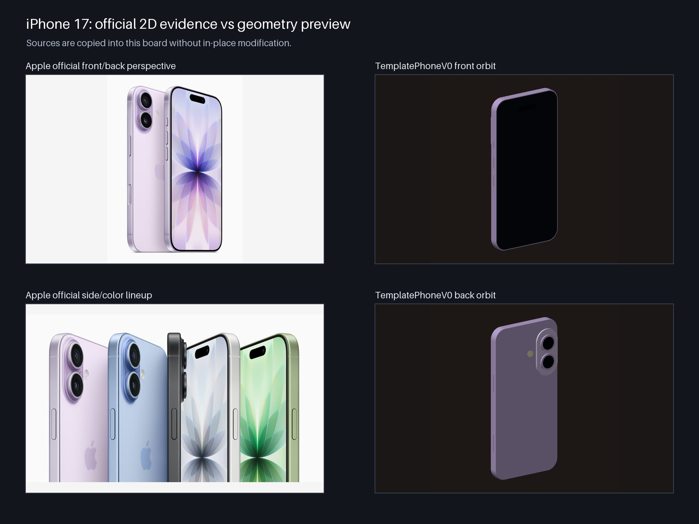

# ViewForge 3D

[English](README.md) | [简体中文](README.zh-CN.md)

> **将多视图二维证据转化为可追踪、带质量门槛的三维模型。**

ViewForge 3D 是一个 Codex 插件和 Python 工作区，用于根据给定的视觉证据重建、精修、绑定、
驱动并验证三维模型。它不只是返回一个看起来合理的几何体：工作流会记录来源、检查结果，并在
几何无法被证据支持时失败关闭。

[最新 Release](https://github.com/d8dzmf5mfn/viewforge-3d/releases/latest) ·
[安装与使用](docs/GUIDE.zh-CN.md) · [Python 环境](docs/VIRTUAL_ENVIRONMENT.zh-CN.md) ·
[ViewForge Local、Tunnel 与 API Key](local-app/USER_SETUP.zh-CN.md)



*演示 — 左侧为 iPhone 17 官方二维参考证据，右侧为项目自建 `TemplatePhoneV0` 几何预览。
该图展示证据与预览之间的可追踪关系，不代表已经用户验收的重建结果，也不是权威 CAD 模型。
Apple 图像与商标权利归其各自权利人所有。*

## 为什么使用 ViewForge？

- **证据驱动** — 针对给定的多视图参考进行重建，不导入第三方成品三维模型。
- **质量门槛** — 先运行自动几何检查和固定视角 QA，再进入用户视觉验收。
- **失败关闭** — 模板缺失、证据不足、拓扑损坏或候选被拒绝时，不会静默退回到看似合理的
  基础体或体素外壳。
- **全程可追踪** — 分开记录来源身份、工作流状态、检查结果和验收状态，便于审计。

## 可以做什么

| 能力 | 输出 |
| --- | --- |
| 多视图重建 | 为受支持的人物、风格化角色和产品提供连续模板拟合；为已对齐的物体轮廓提供六视图 visual-hull 重建。 |
| 声明式 Blender 建模 | 根据结构化模型声明，可重复地构建组件化 Blender 场景并导出模型。 |
| 模型渲染 | 从已有 Blend 或 GLB 生成固定视角 PNG 与预览接触表，并把选定图片直接返回对话进行审阅。 |
| 有边界的几何精修 | 关键点拟合、标注区域压低、保持拓扑的平滑、附着特征和受控手工精修。 |
| 骨架与动画 | 可审计的生物 Armature、只记录旋转的骨骼动画，以及分段模型在无 skin 权重条件下的刚性 Bone Parent 运动。 |
| 只修改外观 | 在保持已验收几何与 UV 不变的条件下修改材质或皮肤。 |
| QA 与来源记录 | 几何门槛、固定视角渲染、重新打开审计、校验和，以及明确的预览/验收状态。 |

## 快速开始

先克隆仓库；如果要运行仓库内的几何脚本，再创建隔离的 Python 环境：

```bash
git clone https://github.com/d8dzmf5mfn/viewforge-3d.git
cd viewforge-3d
```

受支持的 Python 配置参见[虚拟环境指南](docs/VIRTUAL_ENVIRONMENT.zh-CN.md)。在仓库根目录安装
ViewForge Local 和 Codex 插件：

```bash
./local-app/scripts/build_app.sh release
./local-app/scripts/install_app.sh
codex plugin marketplace add "$(pwd)"
codex plugin add viewforge-3d-toolkit@viewforge-3d
```

安装后新建一个 Codex 任务，使插件清单重新加载，再让路由器选择安全工作流：

```text
使用 $viewforge-3d-toolkit:viewforge-3d-router 为这个模型选择安全路线。
```

专项技能、打包方式和输出状态参见[详细指南](docs/GUIDE.zh-CN.md)。如果要让 ChatGPT Developer
Mode 或其他设备访问本地几何运行时，请按照
[ViewForge Local 安装、Tunnel 与 API Key 指南](local-app/USER_SETUP.zh-CN.md)操作。

## 工作方式

1. **锁定证据** — 清点给定视图、哈希、主体配置和每个来源的证据权限。
2. **声明处理路线** — 明确选择重建、声明式建模、有边界精修、外观、骨架或动画，不在过程中
   静默更换方法。
3. **只构建证据支持的内容** — 仅拟合可以被支持的几何，对不可见或缺乏证据的深度保持不确定。
4. **检查产物** — 按所选路线运行拓扑、往返、纹理、绑定和固定视角检查。
5. **分开验收状态** — 自动门槛可以通过，但用户视觉验收仍然可以保持待确认。

## 仓库结构

- `plugins/viewforge-3d-toolkit/` — 可分发的 Codex 插件源码。
- `.agents/plugins/marketplace.json` — 仓库本地 Codex marketplace 清单。
- `LICENSE` — 适用于仓库代码和插件分发内容的 Apache License 2.0 条款。
- `src/face3d/` — Python 几何和验证实现。
- `scripts/` — 确定性构建和审计工具。
- `tests/` — Python 测试。
- `viewer/` — 本地模型与标注查看器。
- `local-app/` — 私有 macOS MCP 宿主及其构建、连接指南。
- `docs/GUIDE.zh-CN.md` — 详细安装和技能调用指南。
- `docs/VIRTUAL_ENVIRONMENT.zh-CN.md` — 隔离 Python 环境配置指南。
- 英文文档分别位于 `README.md`、`docs/GUIDE.md` 和 `docs/VIRTUAL_ENVIRONMENT.md`。

## 边界

- 当任务要求从二维证据重建时，不导入第三方成品三维模型。
- 除非明确声明为独立预览路线，否则 SDF、体素、点云和 Marching Cubes 仅用于质量检查。
- 自动几何门槛通过与用户视觉验收是两个独立状态。
- 静态纯骨架流程不会添加权重、Armature modifier、网格父级关系或动画。
- 纯骨架动画只记录旋转。无 skin 的模型运动只对独立分段组件使用刚性 Bone Parent；连续网格
  无法在无权重条件下弯曲，因此会失败关闭。
- 私有输入图片和受限工程图不会进入插件包。

可分发插件包在本地生成到 `dist/`。生成模型、工作证据、虚拟环境、缓存和其他运行产物不会进入
Git。上方演示图这类经过选择的文档对比素材不会进入生成的插件 ZIP，也不代表第三方图片被项目
许可证重新授权。

标注桥接器与来源无关。使用前必须显式配置锁定输入：

```bash
export VIEWFORGE3D_ANNOTATION_SOURCE_MODEL=/absolute/path/to/source.glb
export VIEWFORGE3D_ANNOTATION_SOURCE_SHA256=<64-character-sha256>
export VIEWFORGE3D_ANNOTATION_SOURCE_VERSION=source-v1
export VIEWFORGE3D_ANNOTATION_SUBJECT_PROFILE=generic-object
npm --prefix viewer run annotate
```

项目专用实验脚本和生成的标注元数据不会进入公开仓库内容。

## 许可证

仓库代码、文档和可分发插件采用 [Apache License 2.0](LICENSE)。第三方参考图片和商标仍归
各自权利人所有，本项目许可证不会对它们重新授权。

插件目录包含内容完全一致的 `LICENSE` 副本，确保 Codex 独立安装后仍保留许可证条款。
